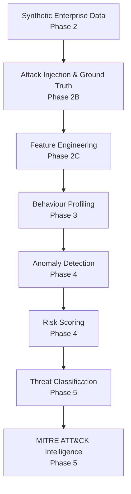
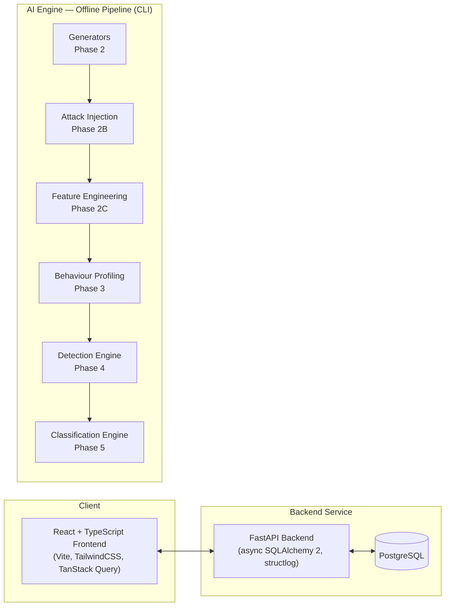
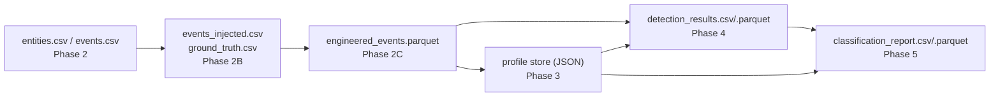
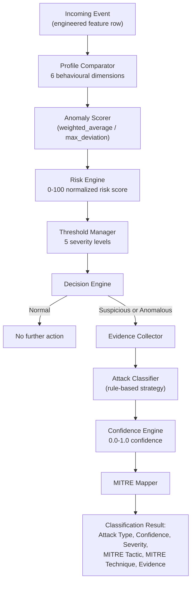

   

# SentinelAI

**AI-Powered Behavioral Anomaly Detection and Threat Intelligence Platform**

Built for the Honeywell Hackathon.

> **Status: Phase 5 complete.** Synthetic enterprise simulation, behavioural profiling, anomaly detection, risk scoring, and threat classification pipelines are implemented and verified end-to-end against real generated data (251,884 events / 2,500 entities). Explainability and live dashboard integration are the next planned phases and are **not** implemented yet.

---

## Table of Contents

- [Architecture](#architecture)
  - [Complete AI Security Pipeline](#complete-ai-security-pipeline)
  - [System Architecture](#system-architecture)
  - [Data Flow](#data-flow)
  - [Detection → Classification Flow](#detection--classification-flow)
- [Tech Stack](#tech-stack)
- [Repository Structure](#repository-structure)
- [Completed Phases](#completed-phases)
- [Design Principles](#design-principles)
- [Quick Start](#quick-start)
- [Roadmap](#roadmap)
- [Design Tokens](#design-tokens)

---

## Architecture

### Complete AI Security Pipeline



Each stage is a separate, independently runnable module in [`ai-engine/`](ai-engine/) that consumes the previous stage's file-based output (CSV / Parquet / JSON) and never modifies it — see [Completed Phases](#completed-phases) for what each stage actually does.

### System Architecture



**Current integration boundary:** the frontend and backend form a working, connected web application (health checks, routing, error handling). The AI Engine is a separate, independently executed pipeline of CLI tools that reads and writes flat files (`ai-engine/data/`). It is **not yet wired into the backend API or the frontend dashboard** — that integration is future work (see [Roadmap](#roadmap)).

### Data Flow



Every arrow is a file on disk, not an in-memory handoff — each phase can be re-run independently against any prior phase's saved output, which is what makes every stage separately testable and auditable.

### Detection → Classification Flow



Ground truth labels are **never** read by any component in this diagram — they are attached to results only after both `DetectionEngine.detect()` and `ClassificationEngine.classify()` return, purely to compute retrospective evaluation metrics.

---

## Tech Stack

| Layer | Stack |
|---|---|
| **Frontend** | React, TypeScript, Vite, TailwindCSS, React Router, Axios, TanStack Query, React Hook Form, Zod, Recharts, Lucide React |
| **Backend** | Python, FastAPI, SQLAlchemy, Alembic, PostgreSQL, Pydantic, Uvicorn |
| **AI** | PyTorch, scikit-learn, NumPy, Pandas, SHAP |
| **Infrastructure** | Docker, Docker Compose |

> The AI Engine's implemented pipeline (Phases 2–5) is currently built on **Pandas, NumPy, PyArrow, and Faker** using deterministic statistical and rule-based methods — no model has been trained yet. PyTorch, scikit-learn, and SHAP are scaffolded dependencies reserved for the trained-model and explainability phases on the [Roadmap](#roadmap).

## Repository Structure

```
sentinel-ai/
├── frontend/               React + TypeScript SPA
├── backend/                FastAPI service
├── ai-engine/               Behavioural anomaly detection & classification pipeline
│   ├── generators/          Synthetic enterprise entity & event generation (Phase 2)
│   ├── profiles/            Behaviour baseline learning & profile store (Phase 3)
│   ├── features/            Behavioural feature engineering pipeline (Phase 2C)
│   ├── detection/           Anomaly detection & risk scoring engine (Phase 4)
│   ├── classification/      Attack classification & MITRE mapping engine (Phase 5)
│   ├── outputs/             Report / CSV / Parquet writers for every phase
│   └── validators/          Validation suites for every phase
├── shared/                 Cross-service contracts
├── docker/                 Dockerfiles for backend and frontend
├── docs/                   Architecture and design documentation
├── scripts/                Setup and developer tooling scripts
└── tests/                  Cross-service integration/e2e tests
```

See [docs/ARCHITECTURE.md](docs/ARCHITECTURE.md) for the system design and [ai-engine/README.md](ai-engine/README.md) for the full module-by-module breakdown of every AI pipeline phase (including the `attacks/`, `config/`, `ground_truth/`, and `schemas/` supporting modules, omitted above for brevity).

---

## Completed Phases

### Phase 1 — Project Scaffolding

- Monorepo architecture
- Frontend / backend / AI-engine structural separation
- Development environment setup
- Docker foundation (Dockerfiles + Compose)
- Base tooling and CI scaffolding

### Phase 2 — Synthetic Enterprise Environment Generator

- Enterprise-scale synthetic event generation
- User / entity behaviour simulation
- CSV generation
- Parquet generation
- Behaviour profiles
- Dataset dictionary
- Generation reports

Generated realistic enterprise activity data used as the input for every downstream phase.

### Phase 3 — Behaviour Profiling Engine

- Behaviour baseline generation
- Entity profile store
- Entity modelling
- Multi-dimensional behavioural analysis
- Historical behavioural profiles
- Profile versioning support

Profiles capture six behavioural dimensions:

- Temporal
- Device
- Resource
- Geographic
- Authentication
- Session

### Phase 4 — Anomaly Detection and Risk Scoring Pipeline

Completed and verified.

**DetectionEngine**
- End-to-end detection workflow orchestration

**Profile Comparator**
- Six-dimensional behavioural comparison (Temporal, Device, Resource, Geographic, Authentication, Session)

**Anomaly Scorer**
- Pluggable scoring strategies:
  - `weighted_average`
  - `max_deviation`

**Risk Engine**
- Combines five risk factors
- Produces a normalized 0–100 risk score

**Threshold Manager**
- Five configurable severity levels
- Strictly increasing boundaries

**Decision Engine**
- Maps risk scores into:
  - Normal
  - Suspicious
  - Anomalous

**Streaming architecture**
- `StreamProcessor.process_event` is the single, sequential execution path used for both historical replay and live-style event-at-a-time processing

**Validation**
- 251,884 events
- 2,500 entities
- Deterministic execution
- Zero validation errors

**Outputs**
- Detection Results (CSV)
- Detection Results (Parquet)
- Risk Score Report
- Detection Metrics
- Detection Summary
- Validation Report

### Phase 5 — Threat Classification and MITRE Intelligence

Completed and verified.

**ClassificationEngine**
- Coordinates the complete attack classification workflow

**Evidence Collector**
- Gathers evidence from:
  - Detection scores
  - Engineered features
  - Behaviour profiles
  - MITRE metadata
  - Historical profile activity

**Strategy Pattern**
- Current: rule-based classifier
- Future: pluggable ML classifier integration, without changing the engine

**Confidence Engine**
- Produces a 0.0–1.0 confidence score per classification

**Attack Registry**
- Maintains name, description, indicators, severity, and MITRE ATT&CK mapping per attack type

**Supported classifications**

- `brute_force`
- `impossible_travel`
- `credential_stuffing`
- `lateral_movement`
- `device_spoofing`
- `low_and_slow_exfiltration`
- `insider_drift`
- `unknown`

**MITRE ATT&CK mapping**

Every classification contains:

- Attack Type
- Confidence
- Severity
- MITRE Tactic
- MITRE Technique
- Evidence

**Verification**

- 4,545 flagged events classified (final verified run, from the 251,884-event / 2,500-entity Phase 4 dataset)
- Validation PASSED
- 0 errors
- 0 warnings

**Outputs**
- Classification Report (CSV)
- Classification Report (Parquet)
- Attack Summary
- Confidence Distribution
- Validation Report

---

## Design Principles

- **Detection and classification are separate stages** — Phase 4 only ever answers "is this anomalous?"; Phase 5 only ever answers "which attack type does this resemble?"
- **Ground truth isolation** — labels are never read as an inference input anywhere in the pipeline; they are attached to results only after detection/classification completes, for evaluation only
- **Explainability** — every classification carries the concrete evidence (matched indicators) that produced it, not just a bare label
- **Deterministic pipelines** — no randomness in scoring, detection, or classification logic; identical input always produces identical output
- **Reproducible experiments** — every run is versioned, timestamped, and written to its own output directory alongside a validation report
- **Strategy-based extensibility** — anomaly scoring and attack classification are both built behind swappable strategy interfaces, so a future trained model can be substituted without touching the surrounding engine
- **Streaming readiness** — the core processing unit (`StreamProcessor.process_event`) handles exactly one event at a time; batch replay is a thin loop around the same path a live feed would use

---

## Quick Start

### 1. Environment Setup

```bash
cp .env.example .env
```

### 2. Run the Web Stack (Docker)

```bash
docker compose up --build
```

Open:
- Frontend: http://localhost:5173
- Backend health check: http://localhost:8000/api/v1/health
- API docs: http://localhost:8000/docs

For local (non-Docker) setup, see the setup scripts in [scripts/](scripts/).

### 3. Run the AI Pipeline

```bash
cd ai-engine
python -m venv .venv
.venv/Scripts/pip install -r requirements.txt

# Phase 2 — generate the synthetic enterprise dataset
.venv/Scripts/python generate_dataset.py

# Phase 2B — inject attacks + ground truth
.venv/Scripts/python attack_orchestrator.py --dataset-dir data/generated/<run_id>

# Phase 2C — engineer behavioural features
.venv/Scripts/python -m features.feature_pipeline \
  --entities data/generated/<run_id>/entities.csv \
  --events data/attacks/<run_id>/events_injected.csv \
  --ground-truth data/attacks/<run_id>/ground_truth.csv

# Phase 3 — build behaviour profiles
.venv/Scripts/python -m profiles.behaviour_profile_engine \
  --entities data/generated/<run_id>/entities.csv \
  --events data/features/<run_id>/engineered_events.parquet
```

#### Detection Engine (Phase 4)

```bash
.venv/Scripts/python -m detection.detection_engine \
  --events data/features/<run_id>/engineered_events.parquet \
  --profile-store data/profiles/store \
  --output-dir data/detections \
  --scoring-strategy weighted_average
```

#### Classification Engine (Phase 5)

```bash
.venv/Scripts/python -m classification.classification_engine \
  --detection-results data/detections/<run_id>/detection_results.csv \
  --events data/features/<run_id>/engineered_events.parquet \
  --profile-store data/profiles/store \
  --output-dir data/classifications \
  --classification-strategy rule_based
```

See [ai-engine/README.md](ai-engine/README.md) for the full command reference, configuration options, and output schemas for every phase.

---

## Roadmap

Realistic, planned next steps — nothing below is implemented yet:

- **ML-based attack classification** — replace/augment the current rule-based `ClassificationStrategy` with a trained multi-class model, using the existing strategy interface
- **Explainability layer** — surface *why* a detection or classification decision was made in a way suitable for analyst review (the current evidence strings are a first step, not a full explainability system)
- **Real-time streaming ingestion** — connect `StreamProcessor` to a live event source instead of replaying historical files
- **Advanced threat intelligence enrichment** — augment MITRE mapping with external threat-intel context
- **Dashboard integration** — wire detection and classification output into the frontend for live analyst visualization
- **Production deployment** — hardened, cloud-hosted deployment of the backend/frontend stack
- **Model monitoring** — drift and performance monitoring for any trained model introduced above

---

## Design Tokens

| Token | Value |
|---|---|
| Primary | `#001F3F` |
| Background | `#F8FAFC` |
| Accent | `#00C2A8` |
