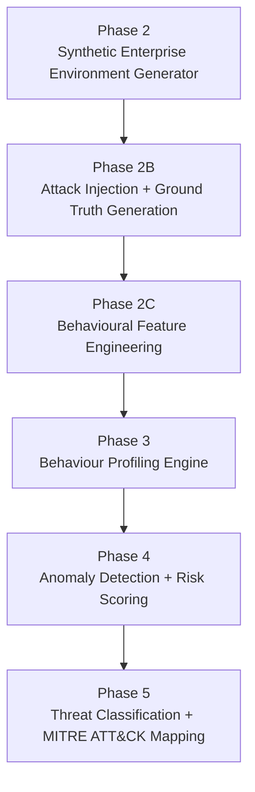

# SentinelAI AI Engine

The AI security intelligence pipeline for SentinelAI. This is a standalone, deterministic, file-based Python pipeline that generates a synthetic enterprise, injects realistic attacks, engineers behavioural features, learns per-entity behaviour baselines, detects anomalies, scores risk, and classifies the resulting threats against MITRE ATT&CK — without a live event stream and without a trained ML model.

For how this pipeline fits into the rest of SentinelAI (frontend/backend/database), see [docs/ARCHITECTURE.md](../docs/ARCHITECTURE.md).

## Table of Contents

- [Architecture Summary](#architecture-summary)
- [Repository Structure](#repository-structure)
- [Implementation Status](#implementation-status)
- [Phase 2 — Synthetic Enterprise Environment Generator](#phase-2--synthetic-enterprise-environment-generator)
- [Phase 2B — Attack Injection and Ground Truth](#phase-2b--attack-injection-and-ground-truth)
- [Phase 2C — Behavioural Feature Engineering](#phase-2c--behavioural-feature-engineering)
- [Phase 3 — Behaviour Profiling Engine](#phase-3--behaviour-profiling-engine)
- [Phase 4 — Detection Engine](#phase-4--detection-engine)
- [Phase 5 — Classification Engine](#phase-5--classification-engine)
- [Installation](#installation)
- [Environment Setup](#environment-setup)
- [Running the Complete Pipeline](#running-the-complete-pipeline)
- [Output Directories and Generated Artifacts](#output-directories-and-generated-artifacts)
- [Validation Reports](#validation-reports)
- [Calibration Notes](#calibration-notes)
- [Troubleshooting](#troubleshooting)

---

## Architecture Summary



Every phase is a separate Python package, invoked independently from the command line, that reads its inputs from files written by the previous phase and writes its own outputs to a new timestamped run directory. No phase holds shared in-memory state with any other — the Phase 3 profile store is the one persistent artifact, and it is itself just versioned JSON files on disk, not a database or service.

## Repository Structure

```
ai-engine/
├── generators/     Phase 2 — synthetic entity and event generation
├── attacks/         Phase 2B — one independent attack-injection module per attack type
├── features/          Phase 2C — behavioural feature extraction
├── profiles/            Phase 3 — behaviour baseline learning and profile storage
├── detection/             Phase 4 — anomaly detection and risk scoring
├── classification/         Phase 5 — attack classification and MITRE mapping
├── outputs/                 CSV / Parquet / Markdown report writers, one file per phase
├── config/                   Typed, validated configuration (generation + attack injection)
├── data/                       Generated datasets, profiles, detections, classifications (gitignored)
├── utils/                       Shared low-level helpers (identifiers, network ranges, time utilities)
├── schemas/                      Shared data contracts (Entity, AccessEvent, enums) — Phase 2, read by every later phase
├── ground_truth/                  Phase 2B — ground-truth label table construction
├── validators/                     Per-phase validation suites (score ranges, consistency, determinism)
├── models/                          Reserved for trained model artifacts — unused, no model trained yet
├── notebooks/                        Reserved for exploratory analysis — unused
├── generate_dataset.py                Phase 2 CLI entry point
├── attack_orchestrator.py              Phase 2B CLI entry point
└── requirements.txt
```

**Folder responsibilities:**

| Folder | Responsibility |
|---|---|
| `generators/` | Builds the synthetic enterprise population and its normal event history — the only phase with no upstream input inside `ai-engine/` |
| `attacks/` | One self-contained module per attack type (`brute_force.py`, `impossible_travel.py`, `credential_stuffing.py`, `lateral_movement.py`, `device_spoofing.py`, `low_and_slow_exfiltration.py`, `insider_drift.py`), plus a shared `AttackModule` base class and a Phase-2-dataset loader |
| `features/` | Converts raw events into 33 typed behavioural features, computed strictly from an entity's history *before* the current event |
| `profiles/` | Learns and persists a versioned per-entity behaviour baseline from Phase 2C's normal-labeled events |
| `detection/` | Compares each event against its entity's profile and produces a Normal / Suspicious / Anomalous verdict with a 0–100 risk score |
| `classification/` | For events Phase 4 already flagged, determines which of 7 known attack categories the evidence most resembles |
| `outputs/` | All report/CSV/Parquet writers — one module per phase, all built on the same `write_csv`/`write_parquet` primitives from Phase 2 |
| `config/` | `SimulationConfig` (Phase 2) and `AttackSimulationConfig` (Phase 2B) — typed, validated dataclasses |
| `data/` | Every phase's generated output, one timestamped subdirectory per run, gitignored |
| `utils/` | Deterministic ID generation, RFC-safe placeholder network ranges, timezone-aware time helpers |
| `schemas/` | The locked `Entity`/`WorkingHours`/`AccessEvent` dataclasses every later phase reads but never modifies |
| `ground_truth/` | Builds the authoritative, separate label table for every event (Phase 2B) |
| `validators/` | One validation module per phase (except Phase 5, whose validator lives inside `classification/` itself) |

## Implementation Status

| Phase | Status |
|---|---|
| Phase 2 — Synthetic Enterprise Environment Generator | ✅ Implemented and verified |
| Phase 2B — Attack Injection and Ground Truth | ✅ Implemented and verified |
| Phase 2C — Behavioural Feature Engineering | ✅ Implemented and verified |
| Phase 3 — Behaviour Profiling Engine | ✅ Implemented and verified |
| Phase 4 — Anomaly Detection and Risk Scoring | ✅ Implemented and verified |
| Phase 5 — Threat Classification and MITRE Mapping | ✅ Implemented and verified |
| Explainability | ⬜ Not implemented |
| ML-based classification | ⬜ Not implemented |
| Real-time/streaming ingestion | ⬜ Not implemented |
| Backend/frontend integration | ⬜ Not implemented |

---

## Phase 2 — Synthetic Enterprise Environment Generator

Produces a realistic, configurable enterprise population and a sequential access-event log modeled on that population's normal behaviour. Every event from this phase is labeled `normal`.

- **Entity generation** — users, service accounts, edge devices, and IoT devices, each with a department, role, privilege level, home location/timezone, working hours, trusted devices, and normal resource set
- **Event generation** — a chronological, per-entity sequence of access events (logins, resource access, command sequences) sampled from each entity's configured behaviour
- **Behaviour simulation** — working-hours bias, weekday/weekend activity patterns, department-specific resource access, remote-work variation
- **Dataset outputs** — CSV and Parquet for both entities and events, a data dictionary, and a generation report

**Verified scale:** 2,500 entities, 251,884 generated events.

```bash
cd ai-engine
.venv/Scripts/python generate_dataset.py
```

Output: `data/generated/<run_id>/entities.csv`, `entities.parquet`, `events.csv`, `events.parquet`, `data_dictionary.md`, `generation_report.md`.

## Phase 2B — Attack Injection and Ground Truth

Injects 7 independent, realistic attack scenarios on top of an existing Phase 2 dataset and produces a separate ground-truth label file, without modifying the original data or its labels.

**Supported attack types:**

| Attack | MITRE Tactic | MITRE Technique |
|---|---|---|
| Brute Force | Credential Access | T1110 Brute Force |
| Impossible Travel | Initial Access | T1078 Valid Accounts |
| Credential Stuffing | Credential Access | T1110.004 Credential Stuffing |
| Lateral Movement | Lateral Movement | T1021 Remote Services |
| Device Spoofing | Defense Evasion | T1036 Masquerading |
| Low-and-Slow Exfiltration | Exfiltration | T1030 Data Transfer Size Limits |
| Insider Drift | Privilege Escalation | T1078 Valid Accounts |

- **Attack scenarios** — each attack is its own module implementing a shared `AttackModule` template (select targets → generate an incident → inject events)
- **Ground truth creation** — a separate `ground_truth.csv` records `event_id`, `entity_id`, `is_attack`, `attack_id`, `attack_type`, `severity`, `mitre_tactic`, `mitre_technique`, and `confidence` for every event, original and injected
- **Validation** — attack injection percentage, dataset integrity, chronological consistency, and entity consistency are all checked before the run is considered complete

```bash
cd ai-engine
.venv/Scripts/python attack_orchestrator.py --dataset-dir data/generated/<run_id>
```

Output: `data/attacks/<run_id>/events_injected.csv`, `events_injected.parquet`, `ground_truth.csv`, `attack_summary_report.md`, `injection_statistics.md`.

## Phase 2C — Behavioural Feature Engineering

Transforms the Phase 2 / Phase 2B event log into 33 typed, documented behavioural features per event — the single source of truth every downstream phase reads from.

- **Behavioural features** — organized into 8 categories: temporal, geographic, device, authentication, behaviour, privilege, statistical, and cold-start
- **Feature extraction** — every feature is computed strictly from an entity's history *before* the current event (via a running `EntityHistoryTracker`), so nothing leaks from the event's own outcome or from ground truth
- **Parquet storage** — the engineered dataset is written as both CSV and Parquet; Parquet is what every later phase actually reads

```bash
cd ai-engine
.venv/Scripts/python -m features.feature_pipeline \
  --entities data/generated/<run_id>/entities.csv \
  --events data/attacks/<run_id>/events_injected.csv \
  --ground-truth data/attacks/<run_id>/ground_truth.csv
```

Output: `data/features/<run_id>/engineered_events.csv`, `engineered_events.parquet`, `feature_dictionary.md`, `feature_summary_report.md`, `validation_report.md`.

> Must be run as `python -m features.feature_pipeline` (not as a direct script) since it lives inside the `features` package.

## Phase 3 — Behaviour Profiling Engine

Learns a persistent, versioned baseline per entity from Phase 2C's engineered events — the behavioural baseline every downstream detection model consults.

- **Baseline creation** — five independent sub-profiles per entity: statistical, sequence, relationship, drift, and cold-start
- **Entity profiles** — capture six behavioural dimensions: Temporal, Device, Resource, Geographic, Authentication, Session
- **Profile store** — one JSON file per entity, holding its complete, append-only version history
- Profiles are built **only** from events labeled `normal`; learning from injected attacks would poison the baseline
- Re-running against new data doesn't overwrite a profile — it versions it and reports how far the entity has drifted from its own prior baseline

```bash
cd ai-engine
.venv/Scripts/python -m profiles.behaviour_profile_engine \
  --entities data/generated/<run_id>/entities.csv \
  --events data/features/<run_id>/engineered_events.parquet
```

Output: `data/profiles/store/<entity_id>.json` (the live profile database) and `data/profiles/runs/<run_id>/profile_summary.csv`, `drift_report.md`, `cold_start_report.md`, `validation_report.md`.

## Phase 4 — Detection Engine

Streams every event against its entity's Phase 3 profile, one at a time, and answers exactly one question — Normal / Suspicious / Anomalous — never which attack type.

**Detection architecture:**

- `ProfileComparator` scores six independent deviation dimensions (temporal, device, resource, geographic, authentication, session) against the entity's `BehaviourProfile`
- A pluggable `AnomalyScorer` strategy collapses the six deviations into one 0–1 anomaly score

**Detection strategies:**

- `weighted_average` — a weighted mean across all six dimensions (default)
- `max_deviation` — the single most deviant dimension drives the score

**Risk scoring:**

- `RiskEngine` blends the anomaly score with historical confidence, cold-start confidence, entity trust (drift-based), and a generic attack-indicator count into a normalized 0–100 risk score
- `ThresholdManager` maps that score to one of 5 configurable severity levels (Informational / Low / Medium / High / Critical)
- `DecisionEngine` derives the final Normal / Suspicious / Anomalous verdict from the same severity boundaries

**Streaming design:** `StreamProcessor.process_event` is the sole per-event execution path; replaying a historical file and consuming a live feed run through identical logic, one event at a time.

**Validation:** score-range, dimension-completeness, and verdict/severity-consistency checks, plus an opt-in determinism check.

**Verified scale:** 251,884 events, 2,500 entities — 247,339 Normal / 3,596 Suspicious / 949 Anomalous, zero validation errors, deterministic across repeated runs.

```bash
cd ai-engine
.venv/Scripts/python -m detection.detection_engine \
  --events data/features/<run_id>/engineered_events.parquet \
  --profile-store data/profiles/store \
  --output-dir data/detections \
  --scoring-strategy weighted_average
```

Output: `data/detections/<run_id>/detection_results.csv`, `detection_results.parquet`, `risk_score_report.md`, `detection_summary.md`, `detection_metrics.md`, `detection_validation_report.md`.

## Phase 5 — Classification Engine

Given an event Phase 4 already flagged Suspicious or Anomalous, classifies which of 7 known attack categories it most closely matches.

**Modules (`classification/`):**

| Module | Responsibility |
|---|---|
| `attack_registry.py` | `AttackType` enum, `AttackDefinition`, `ATTACK_REGISTRY` — the single source of truth for every attack's description, indicators, MITRE mapping, and typical severity |
| `evidence_collector.py` | `EvidenceBundle`, `EvidenceCollector` — gathers detection scores, engineered features, behaviour profile, and profile-version history into one typed bundle |
| `attack_classifier.py` | `ClassificationStrategy` ABC, `RuleBasedClassificationStrategy`, `AttackClassifier` — scores every attack type against the evidence |
| `confidence_engine.py` | `ConfidenceEngine`, `ConfidenceEngineConfig` — turns match strength, win margin, and detection strength into a 0.0–1.0 confidence |
| `mitre_mapper.py` | `MitreMapping`, `map_attack()` — pure lookup of MITRE tactic/technique from the registry |
| `classification_engine.py` | `ClassificationEngine`, `ClassificationResult`, and the CLI orchestrator — run as `python -m classification.classification_engine` |
| `classification_validator.py` | `ValidationIssue`, `ValidationReport`, and the full validation suite for this phase |

- **Rule-based classification strategy** — `RuleBasedClassificationStrategy` scores each attack type as the fraction of its defining indicator checks that fire, built behind a `ClassificationStrategy` interface so a future trained model can be substituted without changing the engine
- **Attack classifier** — `AttackClassifier` wraps the configured strategy; ties between attack types are broken using each candidate's own primary Phase 4 deviation dimension, not arbitrary ordering
- **Evidence collector** — `EvidenceCollector` gathers a typed `EvidenceBundle` from four sources: Phase 4's detection scores, Phase 2C's engineered features, Phase 3's behaviour profile, and the entity's historical profile-version trend
- **Confidence engine** — `ConfidenceEngine` turns match strength, win margin over the runner-up, and Phase 4's own anomaly score into a single 0.0–1.0 confidence
- **MITRE mapper** — `mitre_mapper.map_attack` resolves the canonical MITRE tactic/technique for the chosen attack type from a single `AttackRegistry`
- **Validation system** — confidence-range, attack-type-registered, MITRE-completeness, and evidence-presence checks, plus an opt-in determinism check

**Supported classifications:**

- `brute_force`
- `impossible_travel`
- `credential_stuffing`
- `lateral_movement`
- `device_spoofing`
- `low_and_slow_exfiltration`
- `insider_drift`
- `unknown` — returned when no known attack type scores above the minimum match threshold

Ground truth (`attack_type`), when present, is attached to each result strictly *after* classification completes, for retrospective evaluation only — never as a classification input.

```bash
cd ai-engine
.venv/Scripts/python -m classification.classification_engine \
  --detection-results data/detections/<run_id>/detection_results.csv \
  --events data/features/<run_id>/engineered_events.parquet \
  --profile-store data/profiles/store \
  --output-dir data/classifications \
  --classification-strategy rule_based
```

Only events Phase 4 flagged Suspicious or Anomalous are classified; Normal-verdict events are still walked over internally so each entity's "previous resource in this session" stays causally correct across the entire stream, not just the flagged subset.

Output: `data/classifications/<run_id>/classification_report.csv`, `classification_report.parquet`, `attack_summary.md`, `confidence_distribution.md`, `classification_validation_report.md`.

**Verified scale:** 4,545 flagged events classified, from the same 251,884-event / 2,500-entity Phase 4 run. Validation PASSED — 0 errors, 0 warnings.

---

## Installation

```powershell
cd ai-engine
python -m venv .venv
.venv/Scripts/pip install -r requirements.txt
```

This creates an isolated virtual environment at `ai-engine/.venv` with Pandas, NumPy, PyArrow, and Faker (plus PyTorch, scikit-learn, and SHAP, reserved for future phases).

## Environment Setup

The AI engine has no required environment variables — every command takes its inputs and outputs as explicit CLI flags, so no `.env` file is needed inside `ai-engine/`. (The root `.env` is for the `backend`/`frontend` web stack only.)

Every command below assumes:

```powershell
cd ai-engine
```

and that `.venv` has already been created per [Installation](#installation).

## Running the Complete Pipeline

End to end, from a fresh dataset through classification:

```powershell
# Phase 2 — generate the synthetic enterprise dataset
.venv/Scripts/python generate_dataset.py

# Phase 2B — inject attacks + ground truth
.venv/Scripts/python attack_orchestrator.py --dataset-dir data/generated/<run_id>

# Phase 2C — engineer behavioural features
.venv/Scripts/python -m features.feature_pipeline `
  --entities data/generated/<run_id>/entities.csv `
  --events data/attacks/<run_id>/events_injected.csv `
  --ground-truth data/attacks/<run_id>/ground_truth.csv

# Phase 3 — build behaviour profiles
.venv/Scripts/python -m profiles.behaviour_profile_engine `
  --entities data/generated/<run_id>/entities.csv `
  --events data/features/<run_id>/engineered_events.parquet

# Phase 4 — detect anomalies and score risk
.venv/Scripts/python -m detection.detection_engine `
  --events data/features/<run_id>/engineered_events.parquet `
  --profile-store data/profiles/store `
  --output-dir data/detections

# Phase 5 — classify flagged events against MITRE ATT&CK
.venv/Scripts/python -m classification.classification_engine `
  --detection-results data/detections/<run_id>/detection_results.csv `
  --events data/features/<run_id>/engineered_events.parquet `
  --profile-store data/profiles/store `
  --output-dir data/classifications
```

Replace `<run_id>` with the actual timestamped folder name printed at the end of each command (e.g. `20260726-082419`). Each phase prints its own output directory on completion.

## Output Directories and Generated Artifacts

```
data/
├── generated/<run_id>/         entities.csv/.parquet, events.csv/.parquet, data_dictionary.md, generation_report.md
├── attacks/<run_id>/            events_injected.csv/.parquet, ground_truth.csv, attack_summary_report.md, injection_statistics.md
├── features/<run_id>/           engineered_events.csv/.parquet, feature_dictionary.md, feature_summary_report.md, validation_report.md
├── profiles/
│   ├── store/                    <entity_id>.json — the live, append-only profile database
│   └── runs/<run_id>/             profile_summary.csv, drift_report.md, cold_start_report.md, validation_report.md
├── detections/<run_id>/          detection_results.csv/.parquet, risk_score_report.md, detection_summary.md,
│                                   detection_metrics.md, detection_validation_report.md
└── classifications/<run_id>/     classification_report.csv/.parquet, attack_summary.md,
                                    confidence_distribution.md, classification_validation_report.md
```

Every directory under `data/` is gitignored — it is regenerated by running the commands above, never committed.

## Validation Reports

Every phase produces a `*_validation_report.md` and prints a one-line summary (`Validation: PASSED (0 errors, 0 warnings)` or `FAILED (...)`) before exiting. Phases 2C, 3, 4, and 5 **raise a `RuntimeError`** and exit non-zero if their validation fails, pointing at the exact report file to inspect — a failed validation is treated as a build failure, not a warning to ignore.

What each phase validates:

| Phase | Validates |
|---|---|
| 2B | Injection percentage, dataset integrity, chronological consistency, entity consistency |
| 2C | Schema completeness, row count, no unexpected nulls, value ranges, (opt-in) determinism |
| 3 | Probability-distribution validity, value ranges, version monotonicity, entity consistency |
| 4 | Score ranges (0–1 / 0–100), dimension completeness, verdict/severity consistency, (opt-in) determinism |
| 5 | Confidence ranges, attack-type registration, MITRE-mapping completeness, evidence presence, (opt-in) determinism |

## Calibration Notes

**Risk score calibration (Phase 4).** `RiskEngineConfig`'s five component weights and `ThresholdConfig`'s five severity boundaries are configurable, but their defaults were empirically calibrated against a real run of this pipeline: normal traffic clusters under a risk score of ~5 and rarely exceeds ~31 even at the 99.9th percentile, while confirmed attack events land at ~21–61. The defaults place the `medium`/`high`/`critical` boundaries inside that gap rather than at arbitrary round numbers.

**Classification calibration (Phase 5).** The rule-based strategy scores each attack type as the fraction of its defining indicator checks that fire. Two calibration issues surfaced only once run against real Phase 4 output:

1. Tie-breaking on equal scores originally fell back to alphabetical `AttackType` ordering, which systematically favored `low_and_slow_exfiltration` and `device_spoofing` on every tie regardless of fit. Fixed by breaking ties on each tied candidate's own primary Phase 4 deviation dimension instead.
2. `insider_drift`'s checks originally leaned on profile-level, cross-version drift signals that are structurally inert against a profile store built from a single point in time. Rebalanced toward `behaviour_drift_score` and `session_entropy` — the two per-event signals that empirically separate insider drift from `lateral_movement` and `low_and_slow_exfiltration` in this dataset.

Both fixes are reflected in the shipped code; see `classification/attack_classifier.py` for the current logic.

## Troubleshooting

**`ModuleNotFoundError: No module named 'features'` (or `profiles`, `detection`, `classification`)**
You ran a package-nested entry point as a direct script (e.g. `python features/feature_pipeline.py`). Every entry point from Phase 2C onward must be run as a module from the `ai-engine/` directory: `python -m features.feature_pipeline`, `python -m profiles.behaviour_profile_engine`, `python -m detection.detection_engine`, `python -m classification.classification_engine`.

**`argparse: error: the following arguments are required: ...`**
Every phase from 2C onward takes its inputs/outputs as explicit CLI flags with no defaults for required paths — run the command with `--help` to see the full flag list, e.g. `.venv/Scripts/python -m detection.detection_engine --help`.

**A validation report says `FAILED`**
The command itself exits with a non-zero code and a `RuntimeError` naming the exact report file. Open that `*_validation_report.md` — it lists every individual check that failed, one row per issue, with the event ID and a human-readable reason.

**`Verdicts: normal=... suspicious=0 anomalous=0` (Phase 4 never flags anything)**
Check `data/detections/<run_id>/risk_score_report.md` — if the max risk score across the whole run is well below the configured `medium` threshold, the `ThresholdConfig`/`RiskEngineConfig` defaults may not be calibrated for your dataset (see [Calibration Notes](#calibration-notes)); either use the shipped defaults with the same pipeline that calibrated them, or supply your own `ThresholdConfig`.

**Mixed-precision timestamp parsing errors when writing your own scripts against these files**
Every phase writes `timestamp` as an ISO 8601 string and reads it back with `pd.to_datetime(..., format="ISO8601")`. A plain `pd.to_datetime()` call without that format argument can fail because Python's `datetime.isoformat()` omits microseconds when they are exactly zero, producing two different string lengths in the same column.

**A Phase 5 classification result looks like `unknown`**
This is expected, not an error — it means no known attack type's indicator checks scored above the configured minimum match threshold for that event. Inspect the `score_<attack_type>` columns in `classification_report.csv` for that `event_id` to see how close each category came.

**Re-running Phase 3 against the same input twice**
This is safe and expected — it appends a new version to the entity's profile in `data/profiles/store/`, with drift computed against the prior version. If the input events are identical between runs, `drift_score` will correctly report `0.0`, since nothing actually changed.
