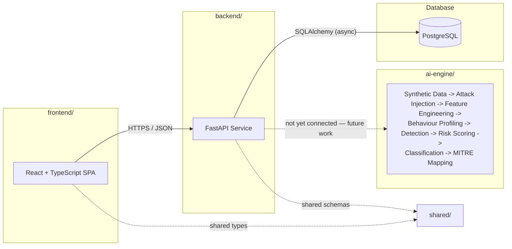
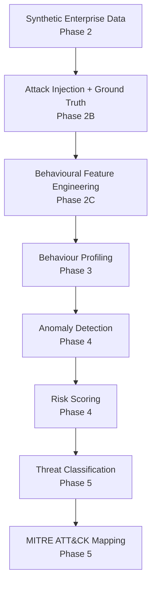
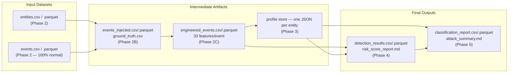
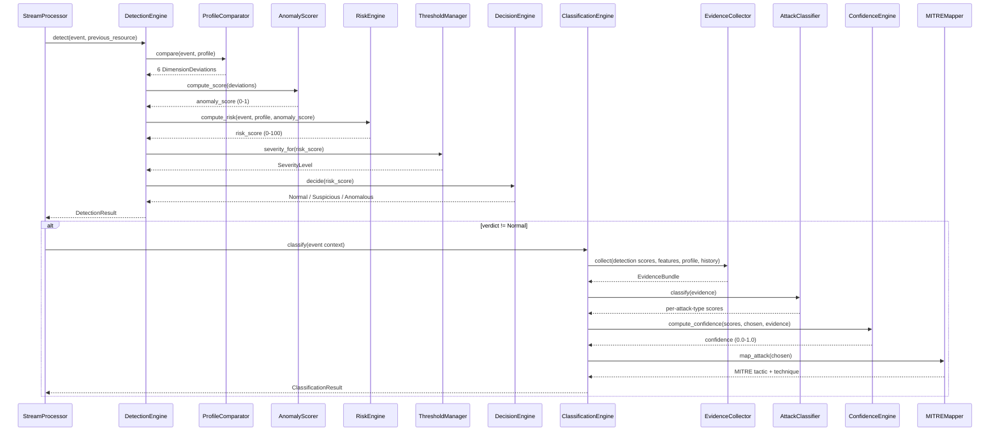

# SentinelAI — System Architecture

**AI-Powered Behavioral Anomaly Detection and Threat Intelligence Platform**

## Table of Contents

- [Overview](#overview)
- [Design Goals](#design-goals)
- [Architecture Diagrams](#architecture-diagrams)
  - [1. Complete Platform Architecture](#1-complete-platform-architecture)
  - [2. AI Pipeline Architecture](#2-ai-pipeline-architecture)
  - [3. Data Flow Architecture](#3-data-flow-architecture)
  - [4. Component Interaction Flow](#4-component-interaction-flow)
- [Frontend Architecture](#frontend-architecture)
- [Backend Architecture](#backend-architecture)
- [AI Engine Architecture](#ai-engine-architecture)
- [Data Storage Architecture](#data-storage-architecture)
- [Data Contracts and Separation of Concerns](#data-contracts-and-separation-of-concerns)
- [Design Principles](#design-principles)
- [Implementation Status](#implementation-status)
- [Current Limitations](#current-limitations)

---

## Overview

SentinelAI is an AI-powered behavioral anomaly detection and threat intelligence platform. It simulates a synthetic enterprise, injects realistic cyberattacks against it, learns per-entity behavioural baselines, detects deviations from those baselines, scores the resulting risk, and classifies flagged events against the MITRE ATT&CK framework.

The platform is composed of three independently deployable services plus a shared contracts package:

| Component | Role |
|---|---|
| **`frontend/`** | React + TypeScript single-page application |
| **`backend/`** | FastAPI service backed by PostgreSQL |
| **`ai-engine/`** | Deterministic, file-based Python pipeline: synthetic data generation → attack injection → feature engineering → behaviour profiling → anomaly detection → risk scoring → threat classification → MITRE ATT&CK mapping |
| **`shared/`** | Contracts kept in sync across services (e.g. TypeScript types mirrored from backend Pydantic schemas) |

The web application (frontend + backend + database) and the AI engine are **both fully built and independently verified**, but they are **not yet wired to each other**. The web application is a live, running service. The AI engine is a separate, deterministic, file-based pipeline invoked from the command line and verified against a real 251,884-event, 2,500-entity dataset. See [Current Limitations](#current-limitations) for the precise integration boundary.

## Design Goals

- **Correctness before integration.** Every phase of the AI engine is built, executed against real data, and validated in isolation before any later phase depends on it — nothing is wired into the next stage until it has been proven to work on its own.
- **No ground-truth leakage.** Detection and classification must be capable of running against data with no labels at all. Ground truth exists solely to *measure* the pipeline retrospectively, never to *drive* it.
- **Determinism over cleverness.** Every scoring, detection, and classification computation is a pure function of its inputs — no hidden state, no randomness at inference time — so the same input always produces the same output and every result is reproducible and debuggable.
- **Composable, file-based stages.** Each phase reads files, writes files, and knows nothing about how its input was produced or how its output will be consumed — this is what lets six pipeline phases be developed, tested, and re-run independently.
- **Explainable by construction, not bolted on.** Every anomaly and every classification carries the concrete evidence that produced it (deviation dimensions, matched indicators) rather than a bare score, even before a dedicated explainability layer exists.
- **Extensible without rewrites.** Anomaly scoring and attack classification are both built behind swappable strategy interfaces specifically so a trained ML model can be substituted later without changing the surrounding engine.

## Architecture Diagrams

### 1. Complete Platform Architecture



Frontend → Backend → Database is a live, working chain today. Backend → AI Engine is the one designed-for, not-yet-built seam — see [Current Limitations](#current-limitations).

### 2. AI Pipeline Architecture



Each stage above is implemented as an independent Python package under `ai-engine/`, invoked separately from the command line — see [AI Engine Architecture](#ai-engine-architecture).

### 3. Data Flow Architecture



Every arrow is a file on disk — CSV, Parquet, or JSON — never an in-memory or network handoff. This is what lets any phase be re-run against a previously saved output without re-executing the whole pipeline.

### 4. Component Interaction Flow



Classification only ever executes on events detection already flagged Suspicious or Anomalous — this single diagram is the entire enforced boundary between the two stages.

## Frontend Architecture

```
frontend/src/
├── components/
│   ├── layout/       AppShell, Sidebar, Topbar — persistent page chrome
│   ├── system/         BackendStatusCard, ErrorBoundary — connectivity and failure UI
│   └── ui/               Reusable design-system primitives
├── config/               Environment/runtime configuration (API base URL, etc.)
├── hooks/                Custom React hooks (e.g. the health-check query hook)
├── lib/                  Framework-agnostic helper utilities
├── pages/                Route-level page components
├── providers/            App-wide context providers (e.g. TanStack Query client)
├── routes/               React Router route definitions
├── services/             Axios-based API client and per-domain service modules
└── styles/               Tailwind configuration and global styles
```

| Technology | Role in SentinelAI |
|---|---|
| **React** | Component-based UI library — the foundation of the entire single-page application |
| **TypeScript** | Static typing across every frontend module, catching contract mismatches with the backend at compile time |
| **Vite** | Development server and production build tooling — fast HMR during development |
| **TailwindCSS** | Utility-first styling, configured with the SentinelAI design tokens (`primary #001F3F`, `background #F8FAFC`, `accent #00C2A8`) |
| **React Router** | Client-side routing between pages inside `routes/` |
| **TanStack Query** | Server-state management for API calls — currently drives the health-check polling in `BackendStatusCard`, configured with bounded retries so a transient backend outage degrades gracefully instead of retrying indefinitely |
| **Recharts** | Charting library, wired into the toolchain and ready to render detection/classification metrics once that data is exposed by the backend (see [Current Limitations](#current-limitations)) |
| **Lucide React** | Icon set used throughout the UI |

Also present: React Hook Form + Zod for form state and schema validation, and Axios as the single shared HTTP client instance.

The frontend currently renders a minimal dashboard shell and a live backend connectivity indicator. It does not yet render detection, risk, or classification results — there is no API surface for those yet.

## Backend Architecture

```
backend/app/
├── api/
│   └── v1/
│       ├── router.py            Versioned API router
│       └── endpoints/
│           └── health.py        GET /api/v1/health
├── core/
│   ├── config.py                 Pydantic settings (env-driven)
│   ├── exceptions.py             Centralized exception handling
│   ├── logging.py                structlog configuration
│   └── middleware.py             CORS / allowed-hosts wiring
├── db/
│   ├── base.py                    SQLAlchemy declarative base
│   └── session.py                 Async engine/session factory
├── middleware/
│   ├── request_logging.py         Structured per-request logging
│   └── timing.py                   Request timing headers
├── models/                        SQLAlchemy ORM models (empty — no persisted domain data yet)
├── repositories/                  Data-access layer (empty — no persisted domain data yet)
├── schemas/
│   └── health.py                   Pydantic response contract for the health endpoint
├── services/                       Business logic (empty — no domain services yet)
├── startup/
│   └── events.py                    Application lifespan hooks
└── main.py                          FastAPI app factory and entry point
```

| Technology | Role in SentinelAI |
|---|---|
| **FastAPI** | The async web framework serving the API — currently exposes one endpoint, `GET /api/v1/health` |
| **SQLAlchemy 2** | Async ORM and database toolkit, schema-migrated with Alembic |
| **PostgreSQL** | The relational database the health endpoint checks connectivity against |
| **Pydantic** | Both application settings (`core/config.py`) and API request/response schemas (`schemas/`) |
| **Uvicorn** | The ASGI server running the FastAPI application |

`GET /api/v1/health` returns `{"status", "service", "version", "database"}` — `200` when the database is reachable, `503` when it is not — and is what the frontend's `BackendStatusCard` polls. `models/`, `repositories/`, and `services/` are present and intentionally empty: they are the seam where AI engine output (detection results, risk scores, classifications) would be persisted and served once that integration is built.

## AI Engine Architecture

```
ai-engine/
├── generators/       Phase 2 — synthetic entity and event generation
├── attacks/           Phase 2B — attack injection modules
├── ground_truth/      Phase 2B — ground-truth label construction
├── features/           Phase 2C — behavioural feature engineering
├── profiles/            Phase 3 — behaviour baseline learning and profile storage
├── detection/            Phase 4 — anomaly detection and risk scoring
├── classification/        Phase 5 — attack classification and MITRE mapping
├── validators/             Per-phase validation suites
├── outputs/                 Per-phase CSV/Parquet/Markdown report writers
├── config/                   Typed, validated configuration
├── schemas/                   Shared data contracts (Entity, AccessEvent, enums)
├── utils/                      Shared low-level helpers (identifiers, network, time)
├── models/                      Reserved for trained model artifacts (unused)
├── notebooks/                    Reserved for exploratory analysis (unused)
└── data/                          Generated datasets, profiles, detections, classifications (gitignored)
```

| Component | Implemented in | Responsibility |
|---|---|---|
| **Generators** | `generators/` | Builds the synthetic enterprise population (2,500 entities) and its normal event history (251,884 events) — the only stage with no upstream input inside `ai-engine/` |
| **Attack Injection** | `attacks/`, `ground_truth/` | Injects 7 independent attack scenarios on top of the Phase 2 dataset and produces a separate, authoritative ground-truth label table |
| **Feature Engineering** | `features/` | Extracts 33 typed behavioural features per event, computed strictly from an entity's history *before* the current event |
| **Behaviour Profiling** | `profiles/` | Learns and persists a versioned per-entity baseline (statistical, sequence, relationship, drift, cold-start) from normal-labeled events only |
| **Detection Engine** | `detection/` (`DetectionEngine`, `ProfileComparator`, `AnomalyScorer`) | Compares each event to its entity's profile across 6 dimensions and produces a 0–1 anomaly score |
| **Risk Scoring** | `detection/` (`RiskEngine`, `ThresholdManager`, `DecisionEngine`) | Blends the anomaly score with confidence, drift, and attack-indicator signals into a normalized 0–100 risk score, then decides Normal / Suspicious / Anomalous |
| **Classification Engine** | `classification/` (`ClassificationEngine`, `AttackClassifier`, `EvidenceCollector`, `ConfidenceEngine`) | For events detection already flagged, determines which of 7 known attack categories the evidence most resembles, with a 0.0–1.0 confidence |
| **MITRE Mapper** | `classification/mitre_mapper.py` | Resolves the canonical MITRE ATT&CK tactic/technique for a classified attack type from a single `AttackRegistry` |

Every component above is invoked independently via `python -m <package>.<module>`, reads its inputs from files on disk, and writes its outputs to a new timestamped run directory under `data/`. See [ai-engine/README.md](../ai-engine/README.md) for the complete developer guide and every CLI command.

## Data Storage Architecture

| Format | Used for | Rationale |
|---|---|---|
| **CSV** | Every phase's primary tabular output | Universally readable, diffable, and directly inspectable without tooling |
| **Parquet** | Every phase's primary tabular output, alongside CSV | Typed and columnar — the format every phase actually reads back in when consuming the previous phase's output, efficient at the full 251,884-row scale |
| **JSON** | The Phase 3 profile store (`data/profiles/store/<entity_id>.json`) | Naturally represents one entity's nested, versioned baseline (statistical/sequence/relationship/drift/cold-start sub-profiles) without a schema migration for every new field |
| **Markdown** | Every phase's human-readable reports (summaries, dictionaries, validation reports) | Renders directly on GitHub, same format as this document |

```
ai-engine/data/
├── generated/<run_id>/         entities.csv/.parquet, events.csv/.parquet, data_dictionary.md, generation_report.md
├── attacks/<run_id>/            events_injected.csv/.parquet, ground_truth.csv, attack_summary_report.md
├── features/<run_id>/           engineered_events.csv/.parquet, feature_dictionary.md, validation_report.md
├── profiles/
│   ├── store/                    <entity_id>.json — the live, append-only profile database
│   └── runs/<run_id>/             profile_summary.csv, drift_report.md, cold_start_report.md
├── detections/<run_id>/          detection_results.csv/.parquet, risk_score_report.md, detection_metrics.md
└── classifications/<run_id>/     classification_report.csv/.parquet, attack_summary.md, confidence_distribution.md
```

No database is used anywhere inside the AI engine. There is no shared cache, message queue, or in-memory service — every cross-phase contract is a file, which is what makes each phase independently testable, inspectable, and re-runnable.

## Data Contracts and Separation of Concerns

**Why detection and classification are separate stages.** `DetectionEngine` answers exactly one question — "is this anomalous?" — and has no notion of attack type anywhere in its code. `ClassificationEngine` answers "which attack type does this resemble?" and is only ever invoked on events detection already flagged. This split exists because the two problems have fundamentally different cost/precision trade-offs: detection must run on every event and stay fast and conservative; classification only needs to run on the small flagged subset and can afford a slower, more speculative, evidence-heavy comparison. Keeping them as separate modules with a narrow interface (a `DetectionResult`, filtered by verdict) between them means either stage can be improved, retrained, or replaced without touching the other.

**Why ground truth is isolated.** Phase 2B's labels (`is_attack`, `attack_type`, `mitre_tactic`, `mitre_technique`, `confidence`, `description`, `injected`) are excluded from every feature column, every profile computation, and every detection/classification input. They are merged back onto results only *after* `detect()` or `classify()` returns, via `dataclasses.replace()`, purely to compute retrospective evaluation metrics (precision/recall for detection, agreement rate for classification). This is enforced structurally, not just by convention: `EvidenceCollector`'s and the feature pipeline's column whitelists never include a ground-truth column.

**Why the pipeline is deterministic.** No component in the AI engine uses randomness at inference time — Phase 2's synthetic data generation is the one place a seeded RNG is used, and it is seeded for reproducibility. Every scoring formula (anomaly score, risk score, confidence score) is a pure function of its typed inputs. This was verified directly: re-running Phase 4 and Phase 5 against the same input data produces identical `risk_score`, `verdict`, `attack_type`, and `confidence` values every time.

## Design Principles

- **Detection and classification are separate stages** — see [Data Contracts and Separation of Concerns](#data-contracts-and-separation-of-concerns)
- **Ground truth is never used as an inference input** — attached to results only after the fact, for evaluation only
- **Explainable evidence accompanies every decision** — every `DimensionDeviation` and every classification indicator carries a human-readable reason string, not just a number
- **Deterministic and reproducible pipeline execution** — no randomness at inference time, verified by repeat runs
- **Strategy-pattern extensibility** — `AnomalyScorer` and `AttackClassifier` are both built behind swappable strategy interfaces so a future trained model can be substituted without touching the surrounding engine
- **Streaming-ready architecture** — `StreamProcessor.process_event` is the sole per-event execution path; batch replay and (future) live consumption are architecturally identical
- **File-based, phase-isolated persistence** — every cross-phase contract is a file, never a shared in-memory object

## Implementation Status

| Phase | Status |
|---|---|
| ✅ Phase 1 — Project Scaffolding | Implemented |
| ✅ Phase 2 — Synthetic Enterprise Environment Generator | Implemented and verified (2,500 entities, 251,884 events) |
| ✅ Phase 2B — Attack Injection and Ground Truth Generation | Implemented and verified |
| ✅ Phase 2C — Behavioural Feature Engineering | Implemented and verified (33 features/event) |
| ✅ Phase 3 — Behaviour Profiling Engine | Implemented and verified |
| ✅ Phase 4 — Anomaly Detection and Risk Scoring | Implemented and verified (251,884 events scored, 0 validation errors) |
| ✅ Phase 5 — Threat Classification and MITRE ATT&CK Intelligence | Implemented and verified (4,545 flagged events classified, 0 validation errors) |
| ⬜ Explainability dashboard | Not implemented |
| ⬜ Backend/frontend integration of AI engine output | Not implemented |
| ⬜ ML-based classification | Not implemented |
| ⬜ Real-time/streaming ingestion | Not implemented |

## Current Limitations

Stated explicitly so the project's actual state is never overstated:

- **The AI Engine currently operates as an offline CLI pipeline.** There is no long-running service, message queue, or streaming ingestion point — every phase is invoked manually against files on disk.
- **Frontend/backend integration with AI results is future work.** The backend has no endpoints or ORM models for detection results, risk scores, or classifications; the frontend has no views for them.
- **The explainability dashboard is future work.** Phase 5's `evidence` field gives a human-readable list of matched indicators per classification, but there is no SHAP-based or visual explainability layer surfaced anywhere yet.
- **ML-based classification is future work.** `AttackClassifier` is built behind a `ClassificationStrategy` interface specifically so a trained model can be substituted later, but no model has been trained — `RuleBasedClassificationStrategy` is the only strategy implemented today.
- **Nothing here has been deployed.** Docker Compose runs the stack locally; there is no cloud deployment, SOC integration, or production traffic of any kind.
